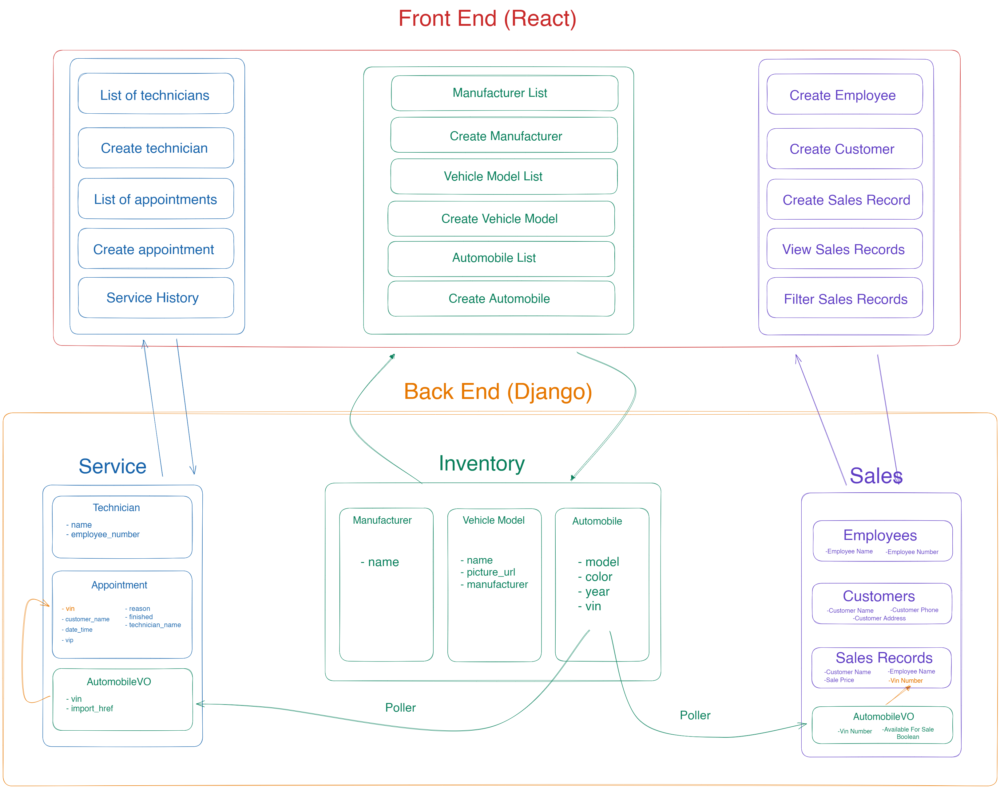

# CarCar

Team:

* Shinwoo Edward Sohn - Service Microservice
* Will Richanbach - Sales Microservice

## Design

CarCar is an application used for automobile dealership management.

To run the Project Beta package from a freshly cloned repository, navigate to the project-beta project folder and execute the following commands:

    docker volume create beta-data

    docker-compose build

    docker-compose up

You will now see seven containers running in Docker:

* service-poller-1
* service-api-1
* sales-poller-1
* sales-api-1
* inventory-api-1
* database-1
* react-1

The Sales microservice will now be available at http://localhost:8090/. The Service microservice will now be available at http://localhost:8080/. Admin access to view or update sales database is available via django web interface at http://localhost:8090/admin and http://localhost:8080/admin, however a user must be configured via command line first.

For RESTful API entities and endpoints, please reference the respective microservices below.

React front-end application will now be available at http://localhost:3000/. This will take you to the Home Page. Within the Home Page will be a navigation bar at the top to access each feature.

## Inventory Microservice

The Inventory microservice provides a RESTful API interface for viewing and creating Manufacturers, Vehicles and Automobiles.

### Manufacturers:

| Action        | Method        | Url   |
| ------------- |:-------------:| :-----|
| List of manufacturers      | GET        | http://localhost:8100/api/manufacturers/ |
| Show manufacturer details     | GET       | http://localhost:8100/api/manufacturers/:id/ |
| Create manufacturer     | POST       | http://localhost:8100/api/manufacturers/ |
| Update manufacturer    | PUT       | http://localhost:8100/api/manufacturers/:id/ |
| Delete manufacturer     | DELETE       | http://localhost:8100/api/manufacturers/:id/ |

GET List example:

                {
                "manufacturers": [
                    {
                    "href": "/api/manufacturers/1/",
                    "id": 1,
                    "name": "Daimler-Chrysler"
                    }
                ]
                }

GET Detail, POST Response & Update Response example:

                {
                "href": "/api/manufacturers/1/",
                "id": 1,
                "name": "Chrysler"
                }

POST Request and Update Request example:

                    {
                    "name": "Chrysler"
                    }

DELETE example:

                    {
                        "id": null,
                        "name": "Chevy"
                    }

### Vehicle Models:

| Action        | Method        | Url   |
| ------------- |:-------------:| :-----|
| List of vehicle models      | GET        | http://localhost:8100/api/models/ |
| Show vehicle model details     | GET       | http://localhost:8100/api/models/:id/ |
| Create vehicle model     | POST       | http://localhost:8100/api/models/ |
| Update vehicle model    | PUT       | http://localhost:8100/api/models/:id/ |
| Delete vehicle model     | DELETE       | http://localhost:8100/api/models/:id/ |

GET List example:

                {
                "models": [
                    {
                    "href": "/api/models/1/",
                    "id": 1,
                    "name": "Sebring",
                    "picture_url": "https://upload.wikimedia.org/wikipedia/commons/thumb/7/71/Chrysler_Sebring_front_20090302.jpg/320px-Chrysler_Sebring_front_20090302.jpg",
                    "manufacturer": {
                        "href": "/api/manufacturers/1/",
                        "id": 1,
                        "name": "Daimler-Chrysler"
                    }
                    }
                ]
                }

GET Detail, POST Response & Update Response example:

                {
                "href": "/api/manufacturers/1/",
                "id": 1,
                "name": "Chrysler"
                }

POST Request and Update Request example:

                    {
                    "name": "Sebring",
                    "picture_url": "https://upload.wikimedia.org/wikipedia/commons/thumb/7/71/Chrysler_Sebring_front_20090302.jpg/320px-Chrysler_Sebring_front_20090302.jpg",
                    "manufacturer_id": 1
                    }

DELETE example:

                   {
                        "id": null,
                        "name": "Camry",
                        "picture_url": "https://upload.wikimedia.org/wikipedia/commons/5/5a/Toyota_Tundra_SR5_Double_Cab_--_12-26-2009.jpg",
                        "manufacturer": {
                            "href": "/api/manufacturers/1/",
                            "id": 1,
                            "name": "Toyota"
                        }
                    }

### Automobiles:

| Action        | Method        | Url   |
| ------------- |:-------------:| :-----|
| List of automobiles      | GET        | http://localhost:8100/api/automobiles/ |
| Show automobile details     | GET       | http://localhost:8100/api/automobiles/:vin/ |
| Create automobile     | POST       | http://localhost:8100/api/automobiles/ |
| Update automobile    | PUT       | http://localhost:8100/api/automobiles/:vin/ |
| Delete automobile     | DELETE       | http://localhost:8100/api/automobiles/:vin/ |

GET List example:

                {
                "autos": [
                    {
                    "href": "/api/automobiles/1C3CC5FB2AN120174/",
                    "id": 1,
                    "color": "yellow",
                    "year": 2013,
                    "vin": "1C3CC5FB2AN120174",
                    "model": {
                        "href": "/api/models/1/",
                        "id": 1,
                        "name": "Sebring",
                        "picture_url": "https://upload.wikimedia.org/wikipedia/commons/thumb/7/71/Chrysler_Sebring_front_20090302.jpg/320px-Chrysler_Sebring_front_20090302.jpg",
                        "manufacturer": {
                        "href": "/api/manufacturers/1/",
                        "id": 1,
                        "name": "Daimler-Chrysler"
                        }
                    }
                    }
                ]
                }

GET Detail, POST Response & Update Response example:

                                                    {
                                    "href": "/api/automobiles/1C3CC5FB2AN120174/",
                                    "id": 1,
                                    "color": "yellow",
                                    "year": 2013,
                                    "vin": "1C3CC5FB2AN120174",
                                    "model": {
                                        "href": "/api/models/1/",
                                        "id": 1,
                                        "name": "Sebring",
                                        "picture_url": "https://upload.wikimedia.org/wikipedia/commons/thumb/7/71/Chrysler_Sebring_front_20090302.jpg/320px-Chrysler_Sebring_front_20090302.jpg",
                                        "manufacturer": {
                                        "href": "/api/manufacturers/1/",
                                        "id": 1,
                                        "name": "Daimler-Chrysler"
                                        }
                                    }
                                    }

POST Request and Update Request example:

                                    {
                                    "color": "red",
                                    "year": 2012
                                    }

DELETE example:

                   {
                        "id": null,
                        "name": "Camry",
                        "picture_url": "https://upload.wikimedia.org/wikipedia/commons/5/5a/Toyota_Tundra_SR5_Double_Cab_--_12-26-2009.jpg",
                        "manufacturer": {
                            "href": "/api/manufacturers/1/",
                            "id": 1,
                            "name": "Toyota"
                        }
                    }

## Service Microservice

The Service microservice provides a RESTful API interface for viewing and creating Appointments, Technicians, and Service History. A polling service makes regular requests to the Inventory API to update AutomobileVO value objects which the service microservice uses to represent vehicles that were purchased from the dealership or not.

The following models and associated parameters are used:

* Appointment
    * vin : Automobile VIN
    * customer_name : Customer Name
    * date_time : Date & Time of Appointment
    * reason : Reason for Appointment
    * vip : Boolean value indicating whether vehicle was purchased from dealership or not
    * finished : Boolean value indicating status of Appointment (Pending/Completed)
    * technician_name : Foreign key to show Technician Name

* Technician
    * technician_name : Technician Name
    * employee_number : Employee Number

* AutomobileVO
    * vin : Unique Vin of Vehicle
    * import_href : The inventory url path for each automobileVO

The Appointment model does not have VIN as a foreign key because clients who do not own a vehicle from the inventory should also be able to make an appointment. The Technician field is a foreign key because many appointments can have a single technician.

### Service Microservice RESTful

| Action        | Method           | URL  |
| ------------- |:-------------:| -----:|
| List of technicians| GET | http://localhost:8080/api/technicians/ |
| Create new technician      | POST      |   http://localhost:8080/api/technicians/ |

GET List of technicians Example:

    {
        "technicians": [
            {
                "technician_name": "Eddy",
                "employee_number": "000001",
                "id": 1
            }
        ]
    }

POST Create new technician Request Example:

    {
        "technician_name": "Jeff",
        "employee_id": "000004"
    }

POST Create new technician Return Example:

    {
        "technician_name": "Jeff",
        "employee_id": "000004",
        "id": 4
    }

| Action        | Method           | URL  |
| ------------- |:-------------:| :-----|
| List of appointments | GET | http://localhost:8080/api/appointments/ |
| Create new appointment     | POST      | http://localhost:8080/api/appointments/ |
| Show appointment details     | GET      | http://localhost:8080/api/appointments/:id/ |
| Update appointment     | PUT      | http://localhost:8080/api/appointments/:id/ |
| Delete appointment    | DELETE      | http://localhost:8080/api/appointments/:id/ |

GET List of appointments Example:

    {
        "appointments": [
            {
                "vin": "1C3CC5FB2AN120174",
                "customer_name": "Vincent",
                "date_time": "2023-03-20T12:30:00+00:00",
                "reason": "Oil Change",
                "vip": false,
                "finished": false,
                "technician_name": {
                    "technician_name": "Eddy",
                    "employee_number": "000001",
                    "id": 1
                },
                "id": 1
            },
        ]
    }

GET Show appointment details Example:

    {
        "vin": "1C3CC5FB2AN120174",
        "customer_name": "Kevin",
        "date_time": "2023-03-20T12:30:00+00:00",
        "reason": "Oil Change",
        "vip": false,
        "finished": false,
        "technician_name": {
            "technician_name": "Eddy",
            "employee_id": "000001"
        },
        "id": 1
    }

POST Create new appointment Request Example:

    {
        "vin": "2FMDK4KC4CBA27842",
        "customer_name": "John",
        "date_time": "2023-11-30 03:30",
        "reason": "Refill Blinker Fluid",
        "technician_name": "Derek"
    }

POST Create new appointment Return Example:

    {
        "vin": "2FMDK4KC4CBA27842",
        "customer_name": "John",
        "date_time": "2023-11-30 03:30",
        "reason": "Refill Blinker Fluid",
        "vip": true,
        "finished": false,
        "technician_name": {
            "technician_name": "Derek",
            "employee_number": "000003",
            "id": 3
        },
        "id": 16
    }

PUT Update appointment details Request Example:

    {
        "customer_name": "Vincent",
        "date_time": "2023-03-30 12:30"
    }

PUT Update appointment details Return Example:

    {
        "vin": "1C3CC5FB2AN120174",
        "customer_name": "Vincent",
        "date_time": "2023-03-30T12:30:00+00:00",
        "reason": "Oil Change",
        "vip": false,
        "finished": false,
        "technician_name": {
            "technician_name": "Eddy",
            "employee_id": "000001"
        },
        "id": 1
    }

DELETE Delete appointment Example:

    {
        "deleted": true
    }

## Sales microservice

The Sales microservice provides a RESTful API interface for viewing and
creating Sales Records, Sales Employees and Customers. A polling service makes regular
requests to the Inventory API to update AutomobileVO value objects which the sales microservice uses to represent vehicles that may be available for sale or have been sold.
By default, when AutomobileVO objects created in the Sales microservice in response to vehicles being added to the Inventory, the made availble_for_sale boolean will be set to True.
When the sale of a vehicle is recorded, the available_for_sale boolean will be set to False.

The following models and associated parameters are used:

* SalesPerson
    * sales_person : Employee Name
    * employee_number : Employee Number

* Customer
    * customer_name : Customer Name
    * address : Customer Address
    * phone_number : Customer Phone Number

* SalesHistory
    * sale_price : Sale Price as decimal value
    * seller : Name of Sales Person
    * buyer : Name of Customer
    * sold_auto_vin : Vin of sold vehicle via Foreign Key with AutomobileVO

* AutomobileVO
    * vin_number : Unique Vin of Vehicle
    * available_for_sale : Boolean value indicating wether available to be sold

There are RESTful endpoints for the following entities:

Sales Person: List or Create Sales Persons

Customer: List or Create Customers

Sales History: List or Create Sales Records

The following documentation describes the available functionality in the Sales API:

### Sales Person:

| Action        | Method        | Url   |
| ------------- |:-------------:| -----:|
| List Sales Persons:      | GET        | http://localhost:8090/api/sales_persons/ |
| Create Sales Person:     | POST       | http://localhost:8090/api/sales_persons/ |

GET List Example:

            {
            "sales_persons": [
                {
                    "sales_person": "John Wooster",
                    "employee_number": "123456789",
                    "id": 1
                }
                ]
            }

POST Request Example:

            {
                "sales_person":"John Wooster",
                "employee_number":"123456789"
            }

POST Return Example:

            {
                "sales_person": "John Wooster",
                "employee_number": "35555",
                "id": 9
            }

### Customer:

| Action        | Method        | Url   |
| ------------- |:-------------:| -----:|
| List Customers:  | GET        | http://localhost:8090/api/customers/ |
| Create Customer: | POST       | http://localhost:8090/api/customers/ |

GET List Example:

            {
        "customers": [
            {
                "customer_name": "Nick Adams",
                "id": 1
            }
            ]
        }

POST Request Example:

            {
                "customer_name":"Nick Adams",
                "address":"555 123 Lane, San Francisco, CA 94010",
                "phone_number":"415-555-1212"
            }

POST Return Example:

            {
	            "customer_name": "Nick Adams",
	            "id": 1
            }

### Sales History:

| Action        | Method        | Url   |
| ------------- |:-------------:| -----:|
| List Sales History:      | GET        | http://localhost:8090/api/sales_history/ |
| Create Sales History:     | POST       | http://localhost:8090/api/sales_history/ |

GET List Example:

            {
    "sales_history": [
        {
            "seller": "John Wooster",
            "buyer": "Nick Adams",
            "sale_price": 500.0,
            "vin_number": "1C3CC5FB2AN120174"
        }
        ]
    }

POST Request Example:

            {
                "buyer":"Nick Adams",
                "seller":"John Wooster",
                "sale_price":"5000",
                "sold_auto_vin": "9999999"
            }

POST Return Example:

            {
	            "seller": "John Wooster",
	            "buyer": "Nick Adams",
	            "sale_price": "5000",
	            "vin_number": "9999999"
            }
